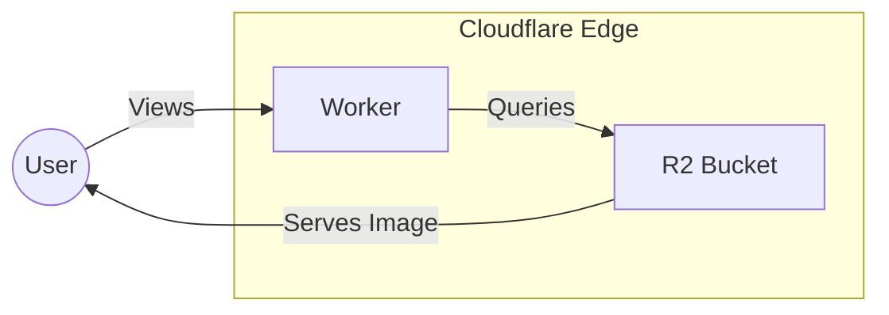

# `cursed.graphics`

**Cursed Graphics** is a simple image sharing website run by [Nerds with No Direction](https://nwnd.party).

Viewers of the website are simply presented with a "cursed" image, and may request another one by clicking the screen.

A simple system architecture overview is as follows:

Internally, images are managed by adding/removing them from an R2 bucket, and the server logic handles the rest.
